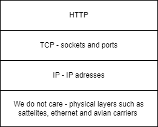

## Part 1 - TCP/IP the foundation
We need to have a basic understanding of the layer underneath us - TCP/IP. TCP/IP is hard to build, but can be simple to use, so it is a great foundation to stand on.
It also provides some motivation for a protocol and understanding of the basic tools.

HTTP 1.1 builds on TCP/IP, so a little bit of what it provides is useful to understand.

IP provides sending packages - but they can get lost, arrive out of order etc.
TCP provides flow control, ordering, retrying etc to give the (illusion) of a stable, bi-directional communication channel.



Ports do not exist on the IP level, a port is an adress of sorts on the TCP layer. A TCP connection consists of two socket pairs. For example, (41.199.222.3:80, 177.41.72.6:3022). 
We typically do not see the clients port (an ephermal port, only used for the duration of the connection), but the adress we connect to is typically a well known port such as 80 or 443. 

We do not need a lot of detail on this, but it is useful to understand which abstraction layer the different concepts belong too.

### 1.1 🧱 - Basic chatting with netcat over TCP/IP
This is a must-do. Let's just talk locally over TCP/IP using netcat.
To listen on a port
```
nc -l localhost 8080
```

Let that run, and open another terminal to connect to that port (the ephermal port is picked for us automatically):
```
nc localhost 8080 
```

Type things, netcat sends line by line as you hit <kbd>ENTER</kbd>.
<details>
    <summary>Video explanation</summary>
  
https://user-images.githubusercontent.com/88324093/218261638-92c15a84-5366-4ed8-be71-0806ec0892f3.mp4

</details>

### 1.2 💡Hanging up properly, closing sockets
This is nice, useful to understand how HTTP sockets work and scale and get re-used etc, but not required for the workshop.
By starting netcat with the ```-q 0``` it will respect hanging up (sending EOF). We send EOF using <kbd>CTRL</kbd>+<kbd>D</kbd>.

This is also shown in the video in 1.1.

### 1.3 💡Finding the IP adress of domains using nslookup
DNS can help us find the IP adresses based on a domain name. We can use the tool ```nslookup blog.bjartnes.dev``` for example.
Try looking up the ip of
- bjartnes.dev
- blog.bjartnes.dev
- cats.bjartnes.dev
- dogs.bjartnes.dev

<details>
    <summary>Solution</summary>


</details>
### 1.4 🎓 Inspecting traffic with tcpdump and/or wireshark.
Wireshark is a graphical UI which is a little easier to use.

On localhost, it is easiest to use ```-i lo``` to listen to the loopback interface, when talking to other machines we can find the interface using ```ifconfig```
```
sudo tcpdump -i lo port 8080 -v
```
### 1.6 🎓 Chatting over TLS 
Try talking to bjartnes.dev and request the frontpage by sending the 
```
GET / HTTP/1.1
Host: bjartnes.dev 
```
Try to follow (as in, by hand, a new request) the link...

Now, try to connect to vg the same way, but his time using 
```ncat --ssl bjartnes.dev 443```
and send the same request.
We are not going to use TLS so much in this workshop, but it is important to know about as it is used everywhere and sneaks in over TCP to make the connections secure.

### 1.7 🎓 Chatting to a machine in the cloud
Setting up netcat on a publicly accessible virtual machine. Allow you to talk to multiple users.

### 1.8 🎓 Using my HTTP chatbot
Highly experimental software.... 
https://github.com/bjartwolf/http_chatbot
