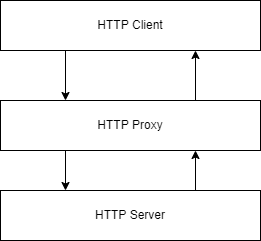

# Part 5 - Talking through proxies
This is where we introduce HTTP proxies, such as nginx. 
This is harder and requires us to be more correct, cheating such as skipping content-length as we did before, will often not work through proxies and we have to do proper content-length or chunked encoding.

If you are not using the codespaces, you have to install nginx on your system. Some files might be in different directories etc, but the overall changes should work the same...





## 💡5.1  talking thorugh nginx


## 💡5.2  talking thorugh nginx with cache on
https://www.nginx.com/blog/nginx-caching-guide

Create a directory to store cache files in and make nginx's www-data user own it.
```
mkdir /var/cache/nginx
chown www-data  /var/cache/nginx
```

In the  ```etc/nginx/sites-enabled/default``` add the following line in the beginning of the file.
```
proxy_cache_path /var/cache/nginx levels=1:2 keys_zone=my_cache:10m max_size=10g inactive=60m use_temp_path=off;
```
and 
```
proxy_cache my_cache; 
```
before the proxy pass line, to tell nginx to use the cache.

Now, if you in the response add a HTTP header for cache-control, for example: 
```
HTTP/1.1 200 OK
Content-Type: text/plain
Cache-Control: public, max-age=604800
Content-Length: 3

HEI
```
Try to call this endpoint multiple times. You can do it by hand, but ```curl http://localhost/``` is a litte bit faster.

### Entire nginx config for cache setup 
Deleted all the comments.
```
proxy_cache_path /var/cache/nginx levels=1:2 keys_zone=my_cache:10m max_size=10g inactive=60m use_temp_path=off;

server {
	listen 80 default_server;
	listen [::]:80 default_server;

	server_name _;

	location / {
		proxy_cache my_cache; 
		proxy_pass http://127.0.0.1:10000;
	}
}
```


## 🎓 5.3 Load testing
Let's see what the cache can do for us.

## 🎓 5.4 Port forwarding from GitHub codespaces
GitHub Codespace (if you set the workshop up using GitHub codespaces) can forward traffic on HTTP, change the proxy to HTTP and listen on a port. Similar to nginx (it might be nginx...), we have to set content length for it to work properly without doing chunked encoding.

## 🎓 5.5 Chunked encoding
TBD
